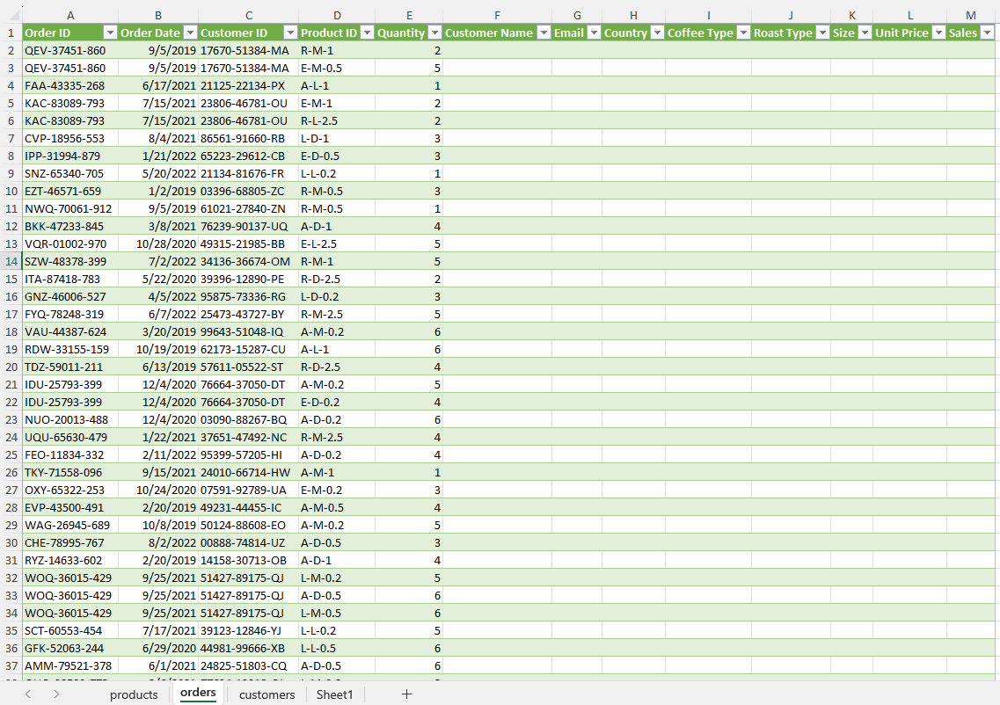
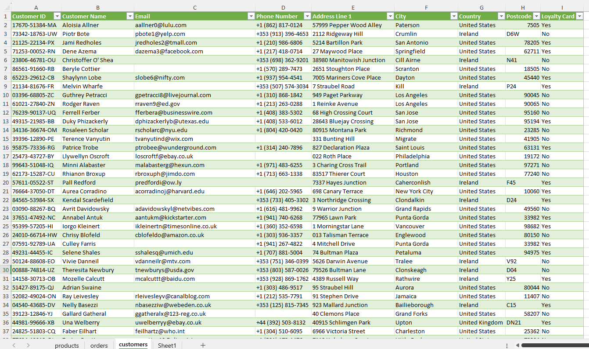

# Coffee Orders Sales

## Introduction
This project focuses on analyzing coffee sales data using Microsoft Excel. The dataset contains detailed records of coffee transactions, including coffee types, sales volumes, customer regions, and dates. The goal of the project is to explore the data, obtain valuable insights, and present the findings in an interactive dashboard.

The process began with a preparation phase. Raw data was reviewed for inconsistencies, missing values, and formatting issues. Once cleaned, Excel functions and pivot tables were used to organize and summarize key metrics such as total sales, revenue by product type, regional performance, and time-based trends.

Next, visualizations were created using Excel's charting tools to facilitate communication of findings. Line charts, bar graphs, and slicers were incorporated to highlight important insights such as top-selling products customer preferences. These elements were integrated into a dynamic dashboard, allowing users to interact with the data through filters and slicers to customize the view based on specific regions, products, or time frames.

## Data Exploration

The data exploration phase began by connecting to the source tables using Power Query in Excel. This tool was used to fetch and preview the underlying data, making it easier to assess the structure and quality before loading it into the workbook. Within the Power Query Editor, the data was checked for consistency in column types, presence of null values, and any obvious formatting issues. The data was pretty clean. After a preliminary inspection confirmed that the data met quality expectations, it was then loaded into Excel as structured tables, ready for transformation and analysis.

Here we have three tables [**Products, Customers, and Orders**]. The analysis will be on the **Orders** table.

## Preparing Tables

After the tables were loaded, they were converted from structured Excel tables into regular ranges. This step was done to simplify the application of formulas and allow for more flexible cell referencing across the worksheet. With the main **Orders** table prepared, the next task was to handle missing values in certain fields such as *customer details* or *product categories*. 

This was achieved using Excel's `XLOOKUP` function in combination with `IF` conditions. The `XLOOKUP` function retrieved the necessary data from the relevant supporting tables (such as the customer or product lookup tables), while the `IF` statements ensured that missing fields were filled with empty strings instead of 0. This ensured that the main data table was complete and accurate, setting the foundation for robust analysis.

## Duplicate Check

Before proceeding to analysis, a thorough check for duplicate records was conducted. This included searching for repeated rows based on key identifiers such as order date, order ID, customer ID, and quantity. Using :x: `Remove Duplicates` The review confirmed that there were no duplicate entries within the dataset, meaning each record represented a unique transaction. With a clean, complete, and well-structured dataset in place, the data was now fully prepared for analysis and visualization.

After completing the initial data wrangling, performing the required formatting and ensuring all missing values were appropriately filled, the table structure was rebuilt to support efficient analysis. This structured format allowed for smooth integration with Excel's analytical tools, especially pivot tables and charts.

## Creating Pivot Tables for Key Sales Insights

With the data ready, several pivot tables were created to summarize the key metrics:

- **Total Sales Over Time**: This pivot table grouped sales by date to observe patterns and fluctuations in revenue across the analysis period.

- **Sales by Country**: This table revealed the geographic distribution of sales, helping to identify strong and weak markets.

- **Sales by Coffee Type**: Sales were aggregated based on the coffee variant (e.g., Arabica, Robusta, Excelsa), showing which types contributed most to total revenue.

- **Sales by Customer**: This view allowed us to rank customers based on their total purchase value, highlighting the most valuable clients.

## Building the Dashboard

An interactive and visually appealing dashboard was then designed to showcase the findings. Styled in a *Coffee* theme with coffee-inspired visuals, the dashboard makes data exploration both informative and engaging. It includes the following components:

- A **Timeline Slicer** to filter data dynamically across different periods.

- Additional **slicers** for *Size*, *Customer Loyalty Card status*, and *Roast Type*, enabling focused analysis across multiple dimensions.

- A **Column Chart** presenting total sales by coffee type, where **Excelsa** coffee stood out with the highest revenue of approximately $12,300.

- A **Line Chart** showing total sales over time, clearly illustrating seasonal fluctuations and demand variations throughout the period.

- A **Bar Chart** displaying the **top 5** customers by purchase value, with data labels indicating whether the customer has a loyalty card or not. Revealing that 4 of the top 5 customers do not have a loyalty card, suggesting a valuable opportunity for the business to offer them one and encourage repeat purchases.

- A **Pie Chart** representing total sales by country, where the USA leads with roughly $35,600 in sales. In contrast, the UK contributes the least (~$2,800), possibly due to cultural preferences, as tea is traditionally more popular there.

Altogether, this dashboard offers a comprehensive, filterable view of the coffee sales performance, empowering stakeholders to make data-driven decisions and explore trends with ease.
