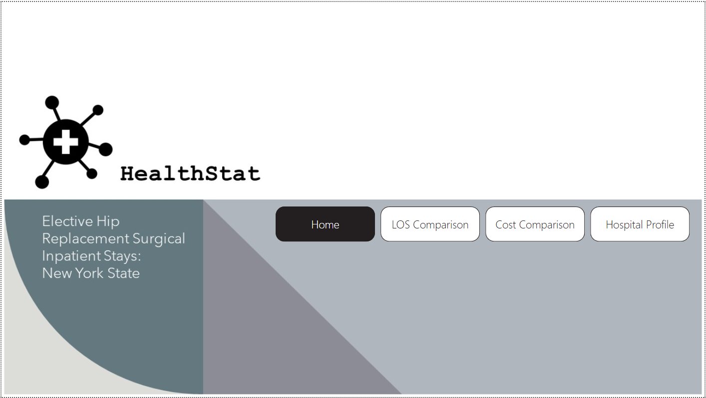
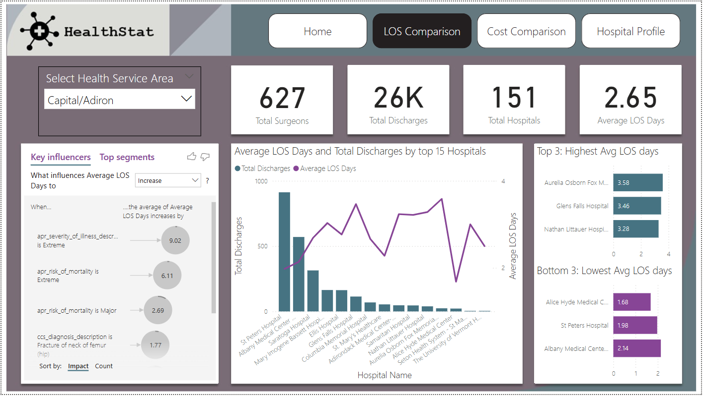
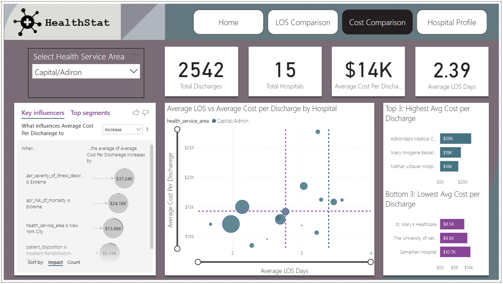
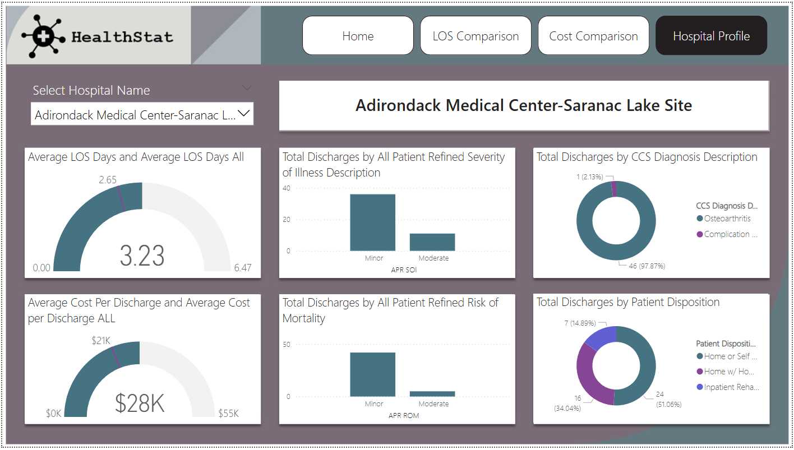

# Analyzing Healthcare Data

## Introduction

This study analyzes real-world dataset for a fictional medical consulting company called HealthStat. It aims analyzing the attributes impacting the **patient length of stay (LOS)**, **cost**, and **each hospital's work** to identify factors contributing to hospital differences.

## Skills Showcased

- **:wrench: ETL:**
Cleaned and structured raw healthcare data using Power Query to ensure quality and consistency before analysis.

- **:art: Data Modeling:**
Designed relational data model to connect variables in concern together.

- **:mag_right: DAX:**
Applied DAX measures and calculated columns.

- **:page_with_curl: Power BI Dashboards:**
Built dynamic and user-friendly dashboards, and utilized advanced visualizations such as Key Influencers.

## Page 1

Page 1 is a *Home Page* designed with the company's theme and has navigation buttons to help in navigating to the pages that contain the analyses of concern in a user-friendly way.

## Page 2

Page 2 analyzes the *Average Length of Stay* providing detailed insights into hospital performance across various regions. It focuses on the average number of days patients stay in hospitals.

- A **slicer** for Health Service Area allows users to filter the data by geographic region, enabling targeted regional analysis.

- The page features a **Key Influencers** visual to identify and explain the main factors impacting the length of stay where we can see that extreme severity of illness and risk of mortality increase the length of stay.

- A **bar chart** displays Total Discharges and Average Length of Stay grouped by Hospital Name, helping users compare hospital performance.

## Page 3

The *Hospital Cost Analysis* page offers a deep dive into the financial performance of hospitals, focusing on the *average cost* per discharge and how it relates to patient stay duration.

- A Health Service Area slicer enables users to filter the data by region, allowing for focused cost comparisons across different geographic areas.

- A scatter chart that visualizes the relationship between Average Length of Stay and Average Cost per Discharge for each hospital. Each point represents a hospital, with the size of the bubble indicating Total Discharges and color-coded by Health Service Area for easy visual grouping. This chart helps identify cost-efficient facilities, and potential outliers.

- A Key Influencers visual further explores the drivers of cost variation, revealing which factors which also are the same for the average LOS.

This page enables HealthStat and its stakeholders to assess cost-effectiveness, allocate resources wisely, and support data-informed healthcare planning.

## Page 4

Page 4 provides a view of how individual hospitals measure up against system-wide benchmarks. 

- Gauge visuals display each hospital’s Average Length of Stay (LOS) and Average Cost per Discharge, allowing users to quickly assess how a facility performs relative to the overall average across all hospitals. These indicators highlight whether a hospital is operating efficiently or falling outside the expected range.

The page also includes detailed breakdowns of Total Discharges by two key clinical dimensions:

APR Severity of Illness (SOI) and APR Risk of Mortality (ROM) – to show how discharge volumes vary across patient severity levels.

CCS Diagnosis Description and Patient Disposition – to explore the most common diagnoses and how patients are discharged (e.g., home, transferred, etc...).

Together, these visuals give HealthStat a picture of hospital performance, not only in terms of cost and efficiency but also in terms of patient complexity and outcomes. This enables healthcare administrators to benchmark facilities, identify performance gaps, and drive quality improvement initiatives across the network.

## Conclusion

This Power BI dashboard project for HealthStat provides a data-driven evaluation of hospital operations, offering valuable insights into patient care efficiency, cost management, and clinical outcomes. By analyzing key metrics such as **Average Length of Stay**, **Cost per Discharge**, **Discharge Volumes**, and **Patient Severity**, the dashboard equips decision-makers with a thorough view of hospital performance across different regions and patient profiles.

Whether used by hospital administrators aiming to optimize operations or by policymakers looking to allocate resources more efficiently, this dashboard serves as a powerful tool for improving quality, efficiency, and patient outcomes across the healthcare landscape.
