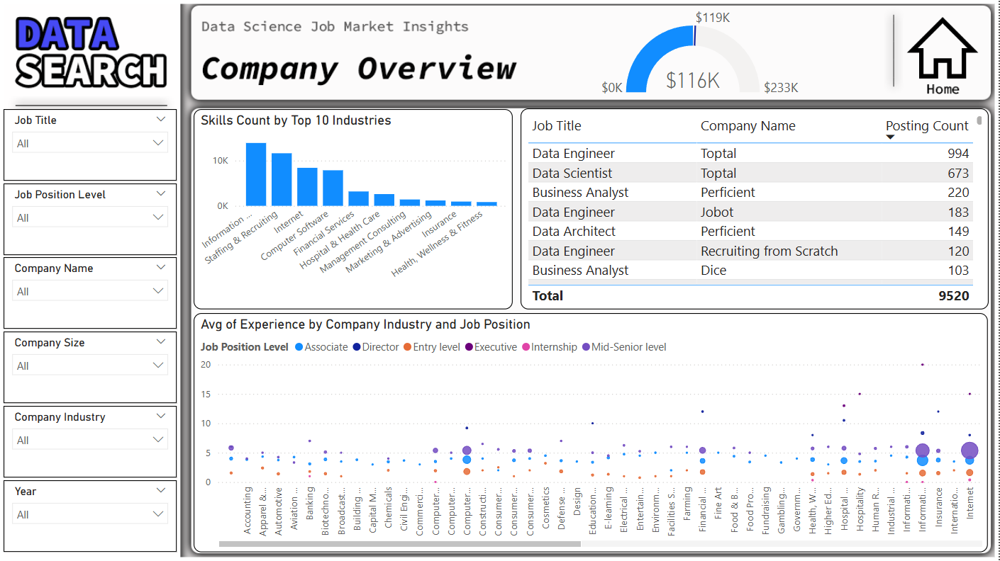

# Analyzing Job Market Data

## Introduction

This analysis is made for investigating the data to find out what skills are most in-demand for different data roles.

## Skills Showcased

- **ETL:**
Cleaned and structured raw job posting data using Power Query to ensure quality and consistency before analysis.

- **Data Modeling:**
Designed relational data models to connect job posts, companies, and skills required for efficient querying.

- **DAX:**
Applied DAX measures and calculated columns to derive KPIs like average salary, job posts count, and skills count.

- **Power BI Dashboards:**
Built dynamic and user-friendly dashboards with slicers, filters, and interactive charts for intuitive data exploration.

- **Data Visualization:**
Presented complex job market trends clearly using bar charts, line graphs, and tables to support insight-driven decisions.

## Page 1

The Home Page serves as the landing screen of the Power BI dashboard, designed with a clean interface that reflects the brand identity of DataSearch. It provides a user-friendly entry point into the analysis with intuitive navigation.

At the center of the page are three interactive buttons that guide users to the core areas of the dashboard:

- **Jobs Overview** – explore trends in job titles, locations, salary ranges, and posting frequency.

- **Skills Overview** – uncover the most in-demand technical and soft skills across industries.

- **Company Overview** – analyze hiring activity, top employers, and recruitment patterns.

This structured layout ensures a seamless user experience, allowing stakeholders to quickly access the insights most relevant to their needs. The home page sets the tone for the entire report, offering clarity and easy accessibility.

## Page 2

The **Jobs Overview** page provides a comprehensive analysis of job postings across positions, skills, and time periods. It features key metrics such as the total number of job postings, average years of experience, and top skills required. Interactive visuals—such as bar charts, and time series graphs—allow users to filter into specific job categories or time frames.

## Page 3

The **Skills Overview** page focuses on analyzing the demand for job-related skills across the market. It highlights the most frequently requested skills in job postings and tracks how the top skills have evolved over time, using visuals like bar charts, and line graphs. Users can explore the percentage share of top skills by year, revealing shifts in employer priorities and emerging technologies.

## Page 4

The **Company Overview** page delivers insights into hiring patterns across different industries and employers. It features visuals such as Skills Count by Top 10 Industries, allowing users to see which skills are most valued in each sector. Additionally, it presents the Average Years of Experience required, broken down by Company Industry and Job Position, offering a clearer picture of role expectations across domains.

## Conclusion

By analyzing job postings, skill demands, and hiring trends across industries and regions, the report offers valuable insights into *what roles are growing*, *which skills are in high demand*, and *how expectations vary by company and position*.

For individuals looking to **start a new career or make a career shift**, this dashboard helps identify in-demand skills, popular job titles, and industries with strong hiring activity—enabling them to target their learning and job search more effectively. Likewise, for **companies aiming to remain competitive**, the analysis highlights critical skills gaps and emerging competencies, providing a foundation to strategically upskill or reskill employees in areas such as data analytics, cloud computing, or AI technologies.

Ultimately, the goal of this project is to bridge the gap between talent supply and demand by transforming labor market data into actionable intelligence—for smarter career planning and more effective workforce development.
